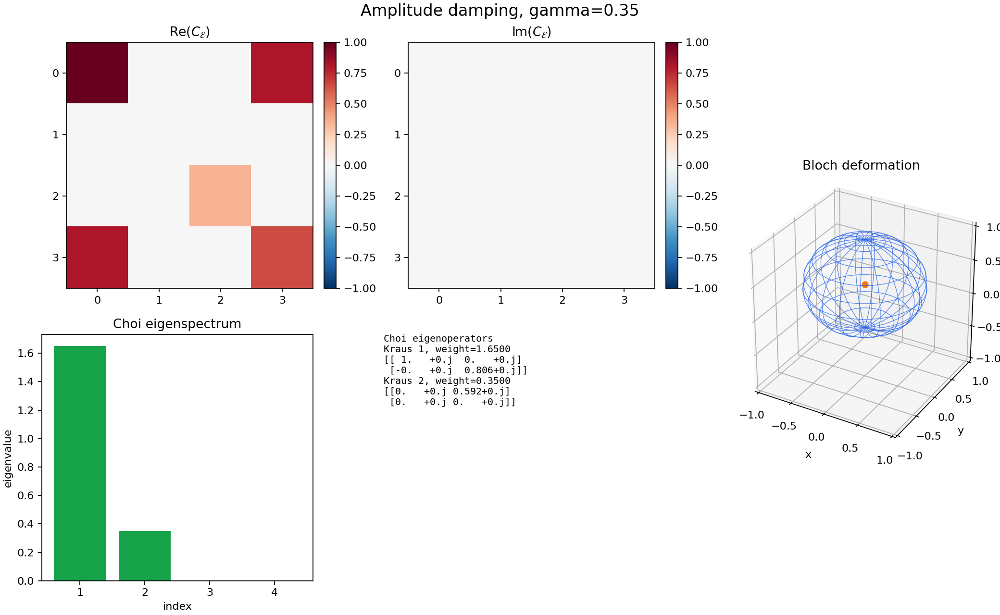

# Agent-5 Interactive Choi Widget

Interactive visualization deliverable for the Choi representation of qubit quantum channels.



## What Is Included

- `main.ipynb`: narrative notebook with the live ipywidgets dashboard and static preview.
- `channel_utils.py`: local channel constructors and Choi utilities using the project convention
  `C_\mathcal{E} = sum_ij |i><j|_A tensor \mathcal{E}(|i><j|)_B`.
- `widget_core.py`: dashboard rendering, Bloch deformation, Kraus extraction, eigenspectrum, and indicators.
- `test_widget_core.py`: focused numerical checks for CP/TP status, partial trace, and channel action.
- `requirements.txt`: dependencies for this folder only.

## Supported Channels

- Depolarizing
- Amplitude damping
- Phase damping
- Bit flip
- Phase flip
- General Pauli channel
- General unital qubit map via Bloch-axis scaling
- Convex mixture of two supported channels

The unital mode intentionally permits non-CP parameter choices so the CP indicator can demonstrate the Choi-positivity condition `C_\mathcal{E} >= 0` directly.  When a map is not CP or not TP, overlap readouts are labeled as Choi overlap indicators rather than process fidelities.

## Run Instructions

From this folder:

```bash
pip install -r requirements.txt
jupyter notebook main.ipynb
```

For a quick non-interactive verification:

```bash
pytest -q
python -c "from widget_core import get_channel_choi, compute_indicators; print(compute_indicators(get_channel_choi('Depolarizing', {'p': 0.2})))"
```

## Notes

The widget is fully local and does not require IBM Quantum access, Qiskit credentials, or network connectivity after dependencies are installed.  The Choi matrix is unnormalized; trace preservation is checked as `Tr_B(C_\mathcal{E}) = I_A`, and a trace-preserving qubit channel has `Tr(C_\mathcal{E}) = d_in = 2`.

The integration-facing application helper is `apply_choi_channel(choi, rho, d_in=None, d_out=None)`.  This widget supports qubit Choi matrices only, so the optional dimensions must be omitted or set to `2`.

The dashboard currently re-renders the full Matplotlib figure on each slider or dropdown update.  This is responsive for the present qubit examples; if larger channels or heavier panels are added, debounce slider updates or separate scalar indicator updates from the full plot redraw.
